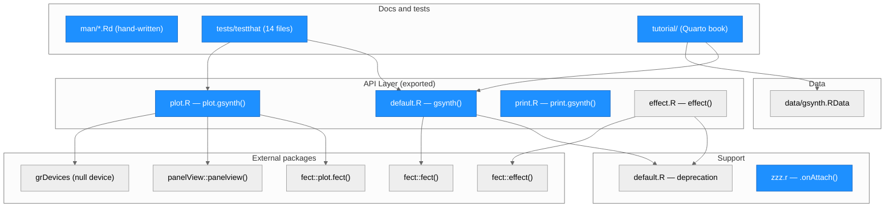
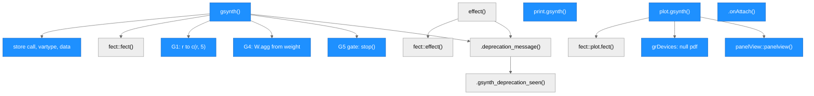
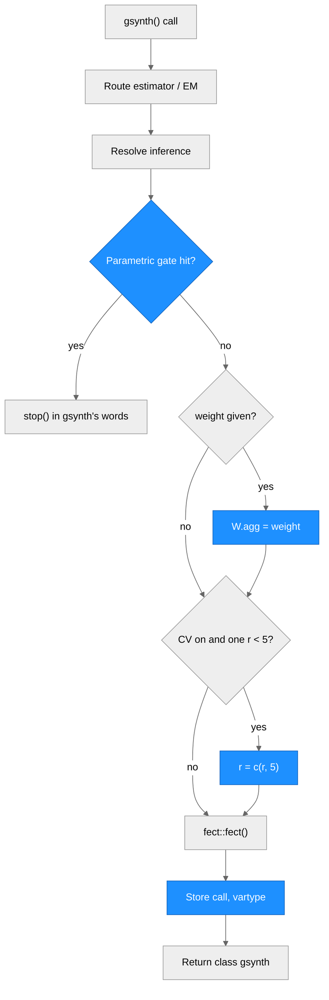

# Architecture — gsynth

> Generated by scriber for run `2026-09-24-fix150-wrapper` on 2026-09-25 (branch `fix/150-wrapper`, gsynth 1.5.0, unreleased).

## Overview

gsynth is an R package for the generalized synthetic control method (Xu 2017). It is pure R (`NeedsCompilation: no`). Since v1.3.0 it has been a thin wrapper around **fect**: `gsynth()` turns gsynth's arguments into fect's (estimator and `EM` routing, inference names, `time.component.from`, the weight role, the search range for `r`, the parametric-inference gate), calls `fect::fect()`, and returns fect's output list with class `"gsynth"` plus the input `data` and the matched `call`. All estimation, cross-validation, bootstrap and most plotting happen in fect. `plot.gsynth()` sends every plot type to `fect::plot.fect()`, except `"raw"` and `"missing"`, which `panelView::panelview()` draws from the data stored in the fit. `print.gsynth()` prints the call and the ATT tables. `effect()` is a soft-deprecated wrapper of `fect::effect()`. Imports: fect (>= 2.4.6), panelView (>= 1.3.1), ggplot2, grDevices. Bundled data: `simdata` and `turnout`. The Rd files and `NAMESPACE` are written by hand (no roxygen run). The user manual is a Quarto book in `tutorial/`, excluded from the package build.

---

## Module Structure

> Blue = modified in this run. `effect.R` changed only in a roxygen comment line (`@return`), so it is not marked.

### Module Reference

| Module / File | Layer | Purpose | Key Exports | Changed |
| --- | --- | --- | --- | --- |
| `R/default.R` | API | `gsynth()`: argument routing, parametric gate, weight role, `r` range, call to `fect::fect()`, storage | `gsynth` | yes (G1, G2, G4, G5; message links) |
| `R/default.R` (top) | Support | Once-per-session soft-deprecation messages (closure over the keys already shown) | internal | no |
| `R/plot.R` | API | `plot.gsynth()`: `"raw"`/`"missing"` via panelView from stored names; other types via `fect::plot.fect()` | S3 `plot` method | yes (G3) |
| `R/print.R` | API | `print.gsynth()`: prints the call and ATT tables; returns `invisible(x)` | S3 `print` method | yes (G2) |
| `R/effect.R` | API | `effect()`: soft-deprecated wrapper of `fect::effect()` | `effect` | roxygen `@return` line only |
| `R/zzz.r` | Support | Startup message (fect requirement, deprecation pointer) | internal | yes |
| `NAMESPACE` | Build | Hand-written imports and exports; `importFrom("grDevices", ...)` added | — | yes |
| `DESCRIPTION` | Build | `Imports: ggplot2, fect (>= 2.4.6), panelView (>= 1.3.1), grDevices` | — | yes |
| `data/gsynth.RData` | Data | `simdata` (50 units x 30 periods, 5 treated) and `turnout` (US states, 1920-2012) | datasets | no |
| `man/*.Rd` | Docs | Hand-written help pages (`gsynth`, `plot.gsynth`, `print.gsynth`, `effect`, package, data, internal) | — | yes |
| `tests/testthat/*.R` | Tests | testthat 3 suite (91 blocks); every fitting block has `skip_on_cran()` | — | yes |
| `tutorial/` | Docs | Quarto book: `index.qmd`, `01-gsynth.Rmd`, `02-ife-mc.Rmd`, `03-plots.Rmd`, `aa-changelog.Rmd` | — | yes |
| `NEWS.md`, `README.Rmd`, `README.md` | Docs | Changelog and GitHub landing page | — | yes |

---

## Function Call Graph

> Blue nodes = changed in this run. Nodes such as "G5 gate" are code blocks inside `gsynth()`, not separate functions.

### Function Reference

| Function | Defined In | Called By | Calls | Changed | Purpose |
| --- | --- | --- | --- | --- | --- |
| `gsynth()` | `R/default.R` | user (exported) | `.deprecation_message`, `fect::fect`, `match.call` | yes | Resolve gsynth's arguments, call fect, return the fit as class `"gsynth"` |
| G5 gate (block) | `R/default.R` | `gsynth` | `stop` | yes | Stop parametric inference with `se = TRUE` for `"mc"` and not-yet-treated `"ife"`/`EM`, in gsynth's argument names (same condition as fect's gate) |
| G4 weight block | `R/default.R` | `gsynth` | `stop` | yes | `weight` becomes `W.agg`; a different `W.agg` stops; `W.est` passes through |
| G1 `r` block | `R/default.R` | `gsynth` | — | yes | With `CV` on, one `r` in [0, 5) for `"gsynth"`/`"ife"` becomes `c(r, 5)` |
| storage block | `R/default.R` | `gsynth` | `match.call` | yes | `call` = the matched call (no `vartype`); `vartype` filled from the resolved inference only if fect left none (se on); `data` stored |
| `.deprecation_message()` | `R/default.R` | `gsynth`, `effect` | `.gsynth_deprecation_seen`, `packageStartupMessage` | no | Show each deprecation message once per session |
| `.gsynth_deprecation_seen()` | `R/default.R` | `.deprecation_message` | — | no | Closure recording the message keys already shown |
| `plot.gsynth()` | `R/plot.R` | `plot()` dispatch | `panelView::panelview`, `grDevices::pdf`/`dev.*`, `fect::plot.fect` | yes | `"raw"`/`"missing"`: build the panelView call from `x[["data"]]`, `Y`, `D`, `X`, `index`, `id`; print to a throwaway device; return the ggplot. Other types: `fect::plot.fect()` |
| `print.gsynth()` | `R/print.R` | `print()` dispatch | `print`, `cat` | yes | Print the call and ATT tables; return `invisible(x)` |
| `effect()` | `R/effect.R` | user (exported) | `.deprecation_message`, `fect::effect` | comment only | Cumulative / sub-group effects; soft-deprecated for `fect::estimand()` |
| `.onAttach()` | `R/zzz.r` | `library(gsynth)` | `packageStartupMessage` | yes | Startup message: requires fect >= 2.4.6; link to the online IFE-EM & MC chapter |

---

## Data Flow

| Step | What happens | Changed |
| --- | --- | --- |
| Route estimator / EM | `method` = `estimator`, or `"ife"` for `EM = TRUE` without `estimator`; soft-deprecation message for `"ife"`, `"mc"`, `EM` | message link only |
| Resolve inference | `NULL` becomes `"parametric"` (gsynth) or `"bootstrap"` (ife, mc); `"nonparametric"` becomes `"bootstrap"`; `time.component.from` defaults by estimator | no |
| Parametric gate | `se = TRUE`, parametric, and `method == "mc"` or `"ife"` with `time.component.from != "nevertreated"`: stop, naming gsynth's arguments | yes (G5) |
| `W.agg = weight` | `weight` is the averaging weight; a different `W.agg` stops; `W.est` passes through | yes (G4) |
| `r = c(r, 5)` | `CV` on, one numeric `r` in [0, 5), estimator `"gsynth"` or `"ife"`; a range, `CV = FALSE`, `r >= 5` and `"mc"` pass unchanged | yes (G1) |
| `fect::fect()` | one call with `vartype = inference`, `W.est`, `W.agg`, `keep.sims = TRUE` | yes (`W = weight` removed) |
| Store | `call` = `match.call()` (no `vartype` added); `vartype` = resolved inference only if `se` is on and fect stored none; `data` = input data; class `"gsynth"` | yes (G2) |

Plotting path: `plot(fit, type)`: if `type` is `"raw"` or `"missing"`, the panelView call is built from the stored data and names (with `id`), printed to a null PDF device, and the ggplot is returned; otherwise the fit is re-classed as `"fect"` and passed to `fect::plot.fect()`, which returns a ggplot (a GGally `ggmatrix` for `"loadings"`).

---

## Architectural Patterns

- **Thin wrapper**: gsynth holds no estimation code. Behaviour and output slots come from fect, so the `?gsynth` Value section documents fect's output list as gsynth returns it, and gsynth releases pin a minimum fect version.
- **Argument translation, not re-implementation**: each gsynth-only argument (`estimator`, `EM`, `inference`, `weight`) is mapped to fect's argument before one `fect::fect()` call. The parametric gate repeats fect's exact condition so the set of stopping calls does not change; only the wording does.
- **Stored call = typed call**: the resolved inference lives in `fit$vartype`, not in `fit$call`, so `print()` and `update()` see what the user typed. fect's readers (`effect()`, `estimand()`) read `fit$vartype` (fect 2.4.6).
- **Duplicate names in fect's output list**: the fit holds two elements named `Y` and `D` (names, then T x N matrices), two named `W` in weighted fits, and duplicated `X`, `T.on`, `method` in `"ife"`/`"mc"` fits. `x$Y` and `x[["Y"]]` return the first. `plot.gsynth()` reads slots with `[[` (exact matching) because `x$data` would partially match `data.long`.
- **Hand-written Rd and NAMESPACE**: running `devtools::document()` would regenerate `man/effect.Rd`, which collides with the hand-written `man/effect.rd` on case-insensitive file systems. Edit Rd files by hand; keep `\usage` in sync with the code (codoc).
- **Once-per-session deprecation messages**: a closure in `R/default.R` records which keys were shown.

---

## Notes

- gsynth 1.5.0 requires the fect fixes of run `2026-09-24-fix246-correctness` (branch `fix/246-correctness`): `effect()` reading `fit$vartype` (A2), weighted parametric bootstrap (A4), `W.agg` kept out of the fit under CV (B4), counterfactual plot without SEs (B6), and `wgt.implied` (B5). The fect PR must merge before the gsynth PR. fect `dev` builds from before and after the fixes both report version 2.4.6, so `fect (>= 2.4.6)` cannot tell them apart.
- `tutorial/` is excluded from the package build (`.Rbuildignore`). Several chapters use cached chunks fitted with earlier fect versions (for example `wgt.implied` values); they need a clean re-render at release.
- Not changed in this run: `fect::fect_mspe()` on a gsynth fit (G6; a gsynth-side fix would change the stored call), and the tracked junk files (`.RData`, `.DS_Store`, `.Rhistory`).
